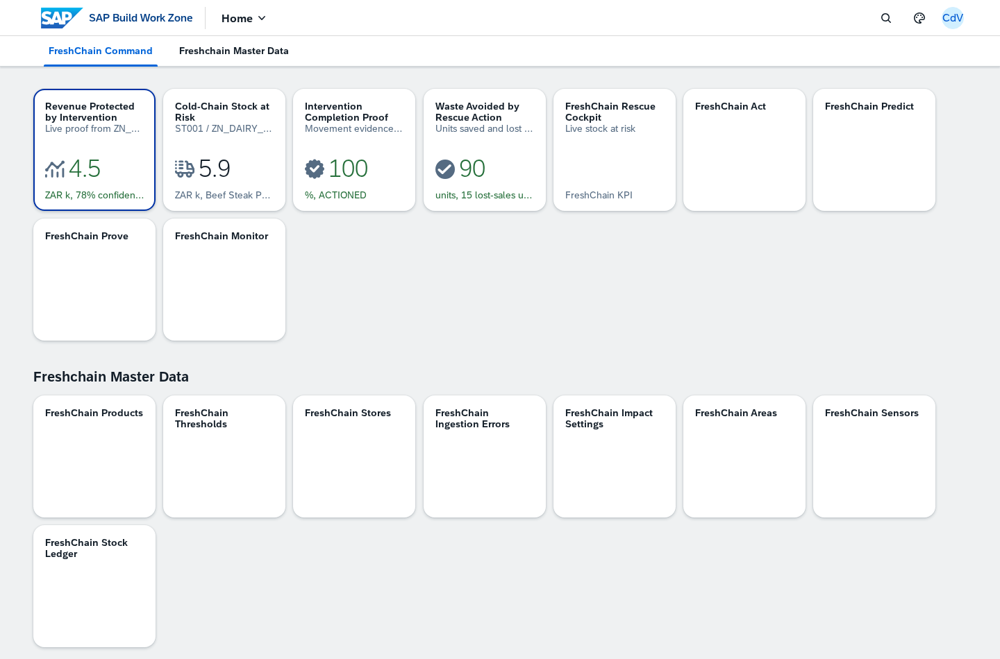
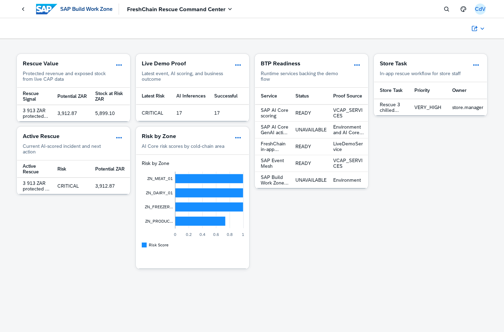
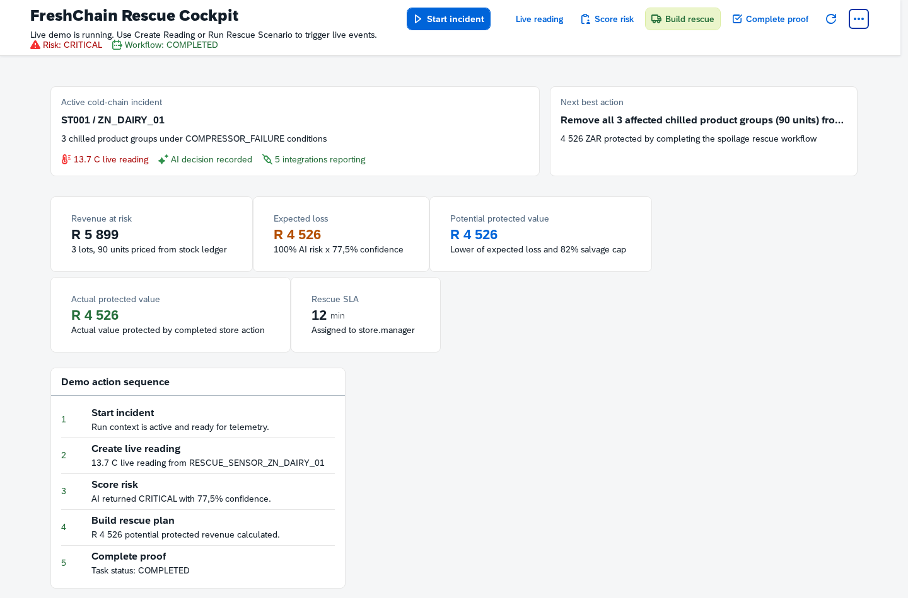
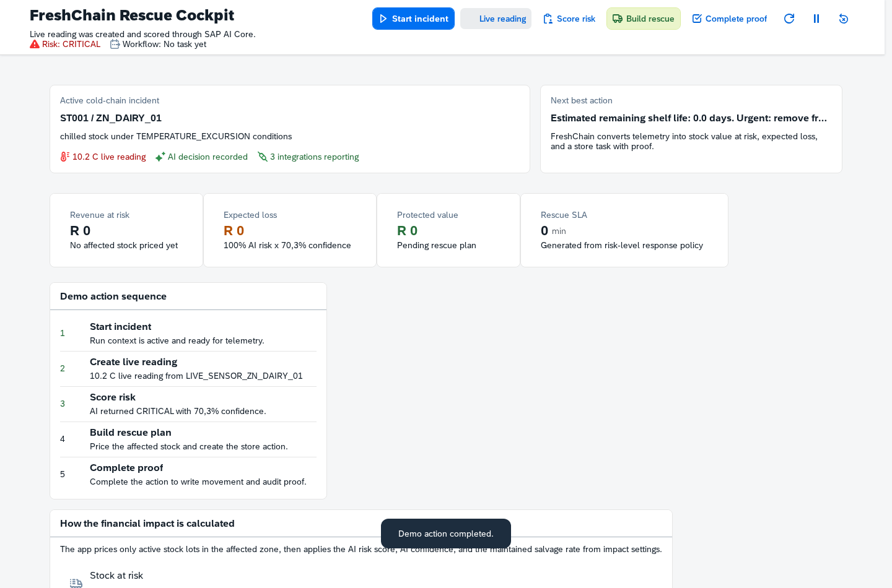
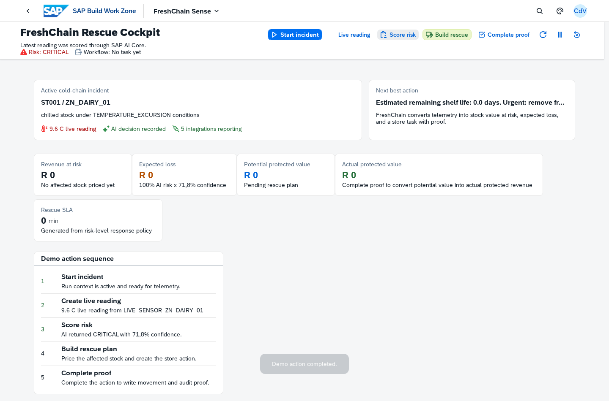
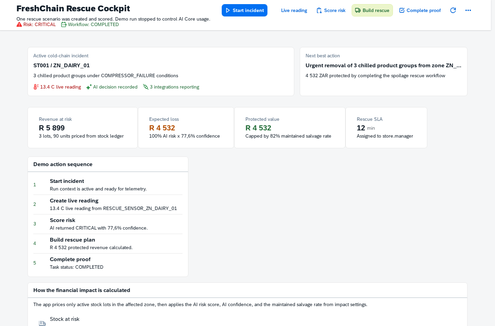
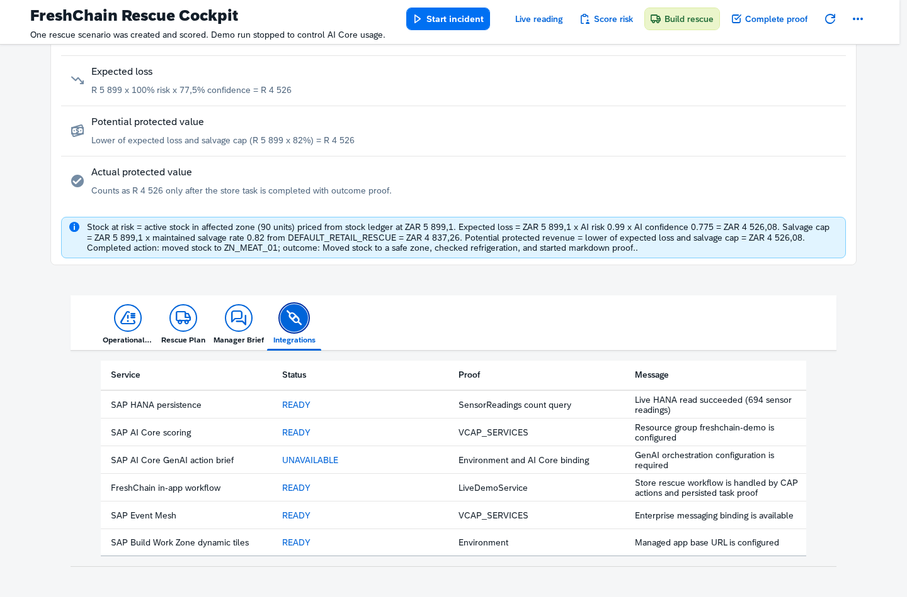
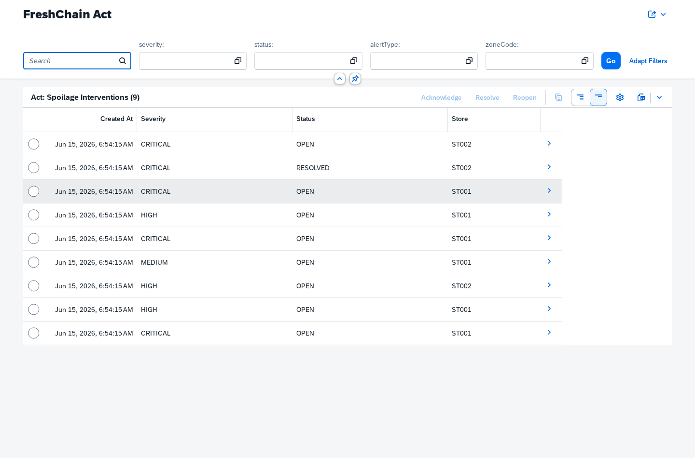
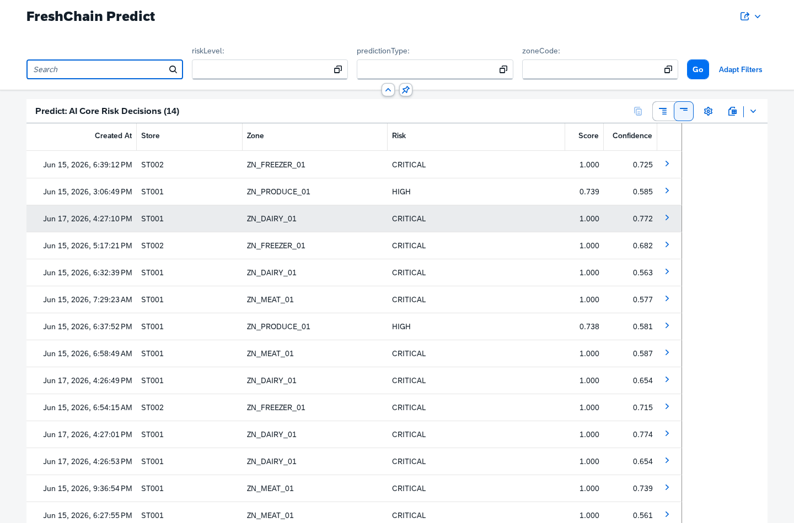
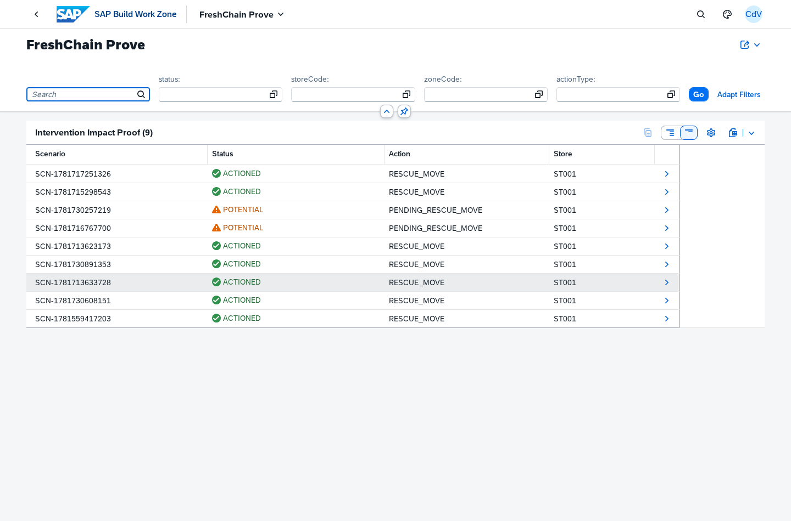

# FreshChain Hackathon Judge Demo Guide

_Last updated: 2026-06-17. Screenshots and demo claims must be based on live persisted system data. The only acceptable mocked input is the live-demo sensor reading payload._

**Presentation readiness rule:** Do not present fixed values from an earlier fallback or continuity run as proof. On 2026-06-17 21:14 UTC, a live run through the deployed Rescue Cockpit completed end to end against CAP/HANA: compressor-failure sensor reading, SAP AI Core score, rescue scenario, in-app workflow task, completed proof, stock movement proof, and actual protected value. Read every business value from the current live persisted run during rehearsal and replace screenshots only after that live run is verified.

## Prize-Winning Narrative
FreshChain is not a dashboard of ambiguous cold-chain data. The demo shows a concrete store incident progressing from telemetry to AI decision, financial impact, assigned workflow, completed store action, and audit proof.

During the verified live run, capture these values from the deployed Work Zone/CAP/HANA flow:

| Proof Point | Source during demo |
|---|---:|
| Store / zone | Live-demo sensor reading payload persisted through CAP/HANA |
| Product at risk | Rescue result calculated from persisted affected lots |
| Risk decision | SAP AI Core scoring response persisted by CAP |
| Affected lots / units | Live stock-ledger rows in the affected zone |
| Stock value at risk | Live financial calculation from persisted stock and pricing |
| Expected loss | Live financial calculation using AI risk score and confidence |
| Potential protected revenue | Live rescue calculation before proof completion |
| Actual protected revenue after task completion | Live completed workflow/proof record |
| Workflow proof | Live task/proof status for the assigned store role |
| AI action brief mode | Live generated action brief, or visible defect if GenAI is unavailable |

Latest validated example from the 2026-06-17 21:14 UTC run: `ST001 / ZN_DAIRY_01`, `COMPRESSOR_FAILURE`, 90 affected units across 3 chilled product groups, R 5 899 stock at risk, R 4 526 expected loss, R 4 526 potential protected value, and R 4 526 actual protected value after completing proof. Treat these as example screenshot values, not hard-coded script lines.

## 6-7 Minute Button-By-Button Flow

### 0:00-0:45 — Open SAP Build Work Zone

**Button/path:** Open SAP Build Work Zone.
**Say:** Start from the real BTP launchpad. Point out that judges are seeing the deployed tenant, not a local mock. Read the first-row KPI tiles left to right: protected revenue, stock at risk, intervention completion proof, and waste avoided. Each value is valid proof only when it resolves from the live CAP route against persisted data.
**Concrete outcome:** FreshChain opens with business outcomes before app launchers: money protected, exposure, proof completion, waste avoided, and then the action apps.

### 0:45-1:20 — Open FreshChain Rescue Command Center

**Button/path:** Open FreshChain Rescue Command Center.
**Say:** Show the executive view. Call out protected revenue, risk by zone, active rescue, store task, and BTP readiness as the first business signals.
**Concrete outcome:** This is the command-center view for an operations manager deciding where to intervene.

**Live validation note:** The Work Zone-hosted app must load from the managed HTML5 repository with OVP cards backed by live CAP/HANA reads. If cards fail or time out, keep the failure visible and use the defect log rather than fallback data.

### 1:20-1:45 — Open FreshChain Rescue Cockpit and press Start

**Button/path:** Open FreshChain Rescue Cockpit, then press Start incident.

**Say:** Press Start. Explain that the demo run is now accepting live events and actions.
**Concrete outcome:** This begins a controlled cold-chain incident run.

### 1:45-2:10 — Press Create Reading

**Button/path:** Press Live reading.
**Say:** Press Live reading. Show the latest event and explain that it is the only mocked input: a sensor payload entering the live CAP/HANA flow.
**Concrete outcome:** A concrete sensor event enters the BTP-backed CAP service.

### 2:10-2:50 — Press Score, then open AI Decision

**Button/path:** Press Score risk, then open AI decision evidence if time allows.
**Say:** Press Score risk. Read the current severity, risk score, confidence, and recommended action from the live SAP AI Core-backed result.
**Concrete outcome:** SAP AI Core scoring turns telemetry into an operational decision. If AI Core cannot score, the app must fail closed and show the real defect.

### 2:50-3:45 — Press Run Rescue, then open Rescue

**Button/path:** Press Build rescue, wait for `Workflow: READY`, then read the KPI row and financial calculation panel.
**Say:** Press Build rescue. Explain the business outcome using the current live values for affected lots, affected units, stock at risk, expected loss, and potential protected value. Point out that actual protected revenue is still zero until proof is completed. Then show the estate-impact panel only if it is clearly labelled as a scenario, not persisted chain-wide evidence.

**Concrete outcome:** The app converts AI risk into financial impact and a recommended rescue action.

**Financial proof to explain:** Stock at risk comes from active stock lots in the affected zone priced from the stock ledger. Expected loss is `stock at risk x AI risk score x AI confidence`. Potential protected value is the lower of expected loss and the salvage cap, where the salvage cap is `stock at risk x maintained salvage rate`. Use only the values shown in the current live run. Actual protected revenue becomes non-zero only after the store task is completed with outcome proof.

**Scale proof to explain:** The estate-impact panel is an explicit extrapolation, not hidden persisted data. It may use the proven single-incident value from the current run as an input, but it must be described as a business-case scenario unless estate-level historical incidents are actually persisted.

### 3:45-4:25 — Open Task and press Complete Task

**Button/path:** Open Operational Proof, confirm the task is ready, then press Complete proof.
**Say:** Open Operational Proof, keep the outcome text, and press Complete proof. Show the live workflow status and actual protected revenue from the completed proof record.
**Concrete outcome:** The store action is not a passive chart: it creates a task, captures the outcome, and exposes proof through the live CAP service.

### 4:25-4:55 — Open Integrations

**Button/path:** Open Integrations.
**Say:** Show SAP HANA, SAP AI Core, GenAI, Event Mesh, Work Zone, and in-app workflow readiness. Mention anything red/yellow as a live platform dependency, not hidden demo magic.
**Concrete outcome:** Judges can see which BTP services back the flow.

### 4:55-5:35 — Open FreshChain Act

**Button/path:** Open FreshChain Act.
**Say:** Show the operational queue as the frontline exception workbench. Point to critical/open rows, severity, status, store, and row actions. Explain that this is where store and operations teams acknowledge, assign, resolve, and reopen spoilage interventions outside the scripted rescue cockpit.
**Concrete outcome:** The solution maps from executive incident to frontline action.

### 5:35-6:10 — Open FreshChain Predict

**Button/path:** Open FreshChain Predict.
**Say:** Show model/deployment/scoring evidence. Point to the latest risk decisions, confidence values, deployment IDs, and timestamps. Explain fail-closed behavior: if AI Core cannot score, FreshChain does not invent predictions.
**Concrete outcome:** The AI story is governed and operational, not just a black-box number.

### 6:10-6:40 — Open FreshChain Prove / Monitor / Ingestion Errors

**Button/path:** Open FreshChain Prove / Monitor / Ingestion Errors.
**Say:** Use FreshChain Prove for the money trail: scenario ID, actioned/potential status, stock value at risk, protected revenue, movement reference, and calculation summary. Use Monitor for the operational health trail: active alerts by zone and severity. Use Ingestion Errors only to show exception handling; if it is empty, say that the current feed has no quarantined payloads.
**Concrete outcome:** The demo includes traceability and exception management.

### 6:40-7:00 — Return to Control Tower

**Button/path:** Return to Control Tower.
**Say:** Close with the real-world result using the current live run values: telemetry became a scored risk decision, then a completed intervention with measured protected value from one store-zone incident.
**Concrete outcome:** FreshChain wins because it turns cold-chain risk into measurable action and proof.

## Presenter Script Notes
- Keep the story anchored to money and waste: “This is 3 chilled product groups in ZN_DAIRY_01, not an abstract data point.”
- Explain the formula before judges ask: stock ledger value, AI risk, AI confidence, maintained salvage rate, lower-of rule.
- Use the phrase “decision to action to proof” repeatedly: event, AI score, rescue scenario, workflow task, completion, protected value.
- When showing SAP AI Core, say that the app fails closed if AI Core cannot score. That is safer than fabricating risk numbers.
- Do not spend time on master data apps. Mention them only as configuration support for stores, products, sensors, thresholds, and impact settings.
- If judges ask whether it is real, point to Work Zone, deployed HTML5 apps, live BTP service bindings, persisted CAP/OData rows, and browser console/network proof. Do not present fallback or in-memory continuity data as a valid solution.
- The visible Work Zone tile should now say `FreshChain Rescue Cockpit`. If a browser cache still shows `FreshChain Sense`, refresh the site and use the defect log wording rather than implying the app itself is still called Sense.
- Treat supporting apps as evidence surfaces, not separate demos: Act proves operational handling, Predict proves AI decisions, Prove proves financial/audit outcome, Monitor proves live exception visibility, and Ingestion Errors proves quarantine behavior.

## Defect / Shortcoming Log

| Area | Observed issue | Impact on prize demo | Workaround for panel | Recommended fix |
|---|---|---|---|---|
| Work Zone first-row KPIs | Resolved on 2026-06-17 at 22:23 UTC. The `FreshChain Command` group now starts with live dynamic tiles for protected revenue, stock at risk, intervention completion proof, and waste avoided. Browser capture showed HTTP 200 for `DynamicTileKpis('protectedRevenue')`, `DynamicTileKpis('stockAtRisk')`, `DynamicTileKpis('rescueProof')`, and `DynamicTileKpis('wasteAvoided')`. | No first-viewport KPI gap remains for the panel flow. Values are still live and time-sensitive. | Read the current values from the Work Zone tiles during rehearsal and the panel demo. If any tile fails, state the live defect rather than using the screenshot as proof. | Keep these tiles first in the command group and recapture the screenshot after the final rehearsal run if values materially change. |
| Work Zone app naming | Resolved for the visible demo path on 2026-06-17 at 22:18 UTC. The HTML5 Apps provider was synced after the dist redeploy, then the local Rescue Cockpit CDM visualization title and target title were corrected. Runtime home now shows `FreshChain Rescue Cockpit`, and launching it opens with the same title. The technical compatibility hash still uses `FreshChainSense-display`. | No visible naming issue remains for the panel flow. The technical hash is still legacy, but the label and opened app title are correct. | Open the visible `FreshChain Rescue Cockpit` tile from Work Zone. Do not mention `Sense` unless asked about the URL/hash history. | Later, replace the compatibility hash with `FreshChainRescueCockpit-display` once Work Zone target resolution accepts the clean semantic object for this site. |
| GenAI action brief | Integration status currently reports `SAP AI Core GenAI action brief: UNAVAILABLE` because GenAI orchestration configuration is required. The rescue flow still completes with SAP AI Core scoring, HANA financial proof, and in-app workflow proof. | Judges may ask whether the generative action brief is live. | Be explicit: AI Core scoring is live and required; GenAI brief generation is a transparent platform configuration gap, not hidden fallback. | Configure the SAP AI Core orchestration endpoint/resource group and rerun the live flow so `ActionBriefs` shows generated brief proof. |
| Rescue Cockpit button semantics | `Live reading` can already produce a scored reading, while `Build rescue` creates the final rescue incident used for proof. The end-to-end outcome is correct, but the sequence can look like a duplicated scoring step. | The presenter may need to explain why the values change between the preliminary reading and final rescue scenario. | Present `Live reading` and `Score risk` as warm-up telemetry/scoring evidence, then say `Build rescue` triggers the concrete compressor-failure incident used for financial proof. | Refactor the app actions so `Live reading` only persists telemetry, `Score risk` only scores the latest reading, and `Build rescue` consumes that same scored reading without creating a second incident. |
| HANA-backed reads | Resolved on 2026-06-17 20:52 UTC. Root cause was the HANA Cloud instance being stopped; app-to-HANA client test returned `HANA Database instance is stopped`. After starting `freshchain-hana-free`, app-to-HANA query succeeded and all key live-demo OData entities returned HTTP 200 through Work Zone. | No longer blocks the demo while HANA remains running. If HANA auto-stops again, cards and actions will fail honestly instead of using fallback data. | Before the panel, confirm `IntegrationStatuses` says `SAP HANA persistence: READY` and `DynamicTileKpis` returns HTTP 200. | Keep HANA Cloud running for the demo window and monitor the dashboard/CLI status. |
| Business value scale | The cockpit can show a single-incident proof plus a labelled extrapolation. The extrapolation is directional, not persisted chain-wide evidence. | Judges can understand upside, but may ask what is real versus assumed. | State the current single-incident proof value from the live run, then label any annualized or multi-store panel as a business-case scenario. | Later, populate estate-level KPIs from multi-store historical incidents instead of a demo assumption. |
| HTML5 app-host content | On 2026-06-17, the app-host was restored by pushing the full FreshChain HTML5 app set. `cf html5-list` showed all deployable apps under `freshchain-html5-repo-host` after the repair. | A partial app-host upload can make apps 404 even though tiles still appear. | Use the current live tenant only after Control Tower, Rescue Cockpit, Act, Predict, Prove, and Monitor load from Work Zone without fallback data. | When doing UI-only deployments, push the complete HTML5 app set or use the MTA content module without redeploying the DB module. |
| Operations/Prove depth | Operations, Prove, Monitoring, and Ingestion Errors are Fiori list/object surfaces, not dramatic cockpit screens. Live route validation shows they load without FreshChain/OData failures, but they need deliberate narration. | Secondary apps can feel like supporting lists rather than proof surfaces if shown without context. | Keep these screens short: Act = frontline work queue, Predict = AI decision log, Prove = financial/audit proof, Monitor = alert health, Ingestion Errors = quarantine proof. | Add clearer default filters, object titles, and value-focused columns for panel-ready screenshots after the main demo is stable. |
| Screenshots and fixed values | Screenshots in `docs/demo-guide/screenshots` were recaptured after the 2026-06-17 live run. Values are still time-sensitive because each new run writes new persisted readings, predictions, tasks, and impact rows. | Hard-coding the screenshot values in narration can become stale after another run. | Use the screenshots to explain the flow, but read the live values from the app during rehearsal and final presentation. | Recapture the screenshots after the final rehearsal run if the visible values materially change. |
| Headless Work Zone screenshots | Work Zone loads the Rescue Cockpit iframe and app resources, but headless screenshots can intermittently paint only the iframe header while the DOM and app text are present. | Presentation screenshots of detailed cockpit steps may miss Work Zone chrome. | For the panel, open the cockpit manually from Work Zone; use screenshots only after the data is verified live. | Use native browser screenshots or the direct managed HTML5 app URL for detailed cockpit captures, with clear evidence that backend actions used live persisted data. |

## Capture Notes
- Work Zone screenshot was captured from: https://afsug-hackathon.launchpad.cfapps.eu20.hana.ondemand.com/site?siteId=97d11aec-866b-4a20-8f25-695b8927576e#Shell-home after syncing the HTML5 Apps channel. Treat any displayed KPI as presentation proof only after the current value is verified against live persisted CAP/HANA data.
- Control Tower, Work Zone home, Rescue Cockpit, Act, Predict, Prove, Monitor, and Ingestion Errors screenshots were recaptured on 2026-06-17 after the HANA and GenAI persistence fixes. The detailed Rescue Cockpit tab screenshots use the direct managed HTML5 app URL because headless Work Zone iframe screenshots intermittently painted only the shell header even when the live app DOM and OData calls were correct.
- Work Zone launch paths validated on the live tenant after the service fix: FreshChain Rescue Command Center, FreshChain Rescue Cockpit, FreshChain Act, FreshChain Predict, FreshChain Prove, FreshChain Monitor, and FreshChain Ingestion Errors. Browser capture reported no bad or failed FreshChain/OData requests; remaining console noise was SAP shell deprecations/plugin warnings.
- Current live validation after the HTML5 dist redeploy, provider sync, and local CDM title fix: the Work Zone home page shows `FreshChain Rescue Cockpit` and no longer shows `FreshChain Sense`. The technical compatibility hash `#FreshChainSense-display` still opens the app with the corrected title; `#FreshChainRescueCockpit-display` remains a future cleanup once target resolution accepts the clean semantic object.
- Current live validation after the KPI group update: the Work Zone first row shows protected revenue, stock at risk, intervention completion proof, and waste avoided before the app launch tiles. Browser capture reported HTTP 200 for all four `DynamicTileKpis(...)` calls and no FreshChain/OData failed requests.
- The first attempted HTML5 redeploy used raw `webapp` folders and caused `Component-preload.js` 404s. The app-host was immediately repaired by rebuilding every `dist` folder and redeploying the complete dist set; the follow-up audit showed no FreshChain/OData failed requests for home, Control Tower, or the legacy Rescue Cockpit entry.
- Control Tower BTP Readiness may show `SAP Build Work Zone dynamic tiles` as `READY` after setting `FRESHCHAIN_MANAGED_BASE_URL` on `freshchain-srv` and restarting the app, but readiness status is not a substitute for live business-data proof.
- Content Manager showed the Control Tower visualization as `Dynamic Tile` after the HTML5 Apps provider sync. The tile preview may show a placeholder while the runtime Work Zone page resolves the live KPI value.
- Fallback mode is no longer an acceptable demo path. Validate Start, Create Reading, Score, Build Rescue, Complete Proof, dynamic tile, and BusinessImpactSummary through the managed Work Zone route only when those calls are backed by persisted live system data.
- Detailed Rescue Cockpit action screenshots must be recaptured from the managed Work Zone route or direct managed HTML5 app URL only after the backend actions are verified against live persisted data.
- Do not commit or present auth files, service keys, or the temporary local proxy. Only the screenshots and this guide are intended presentation artifacts.
